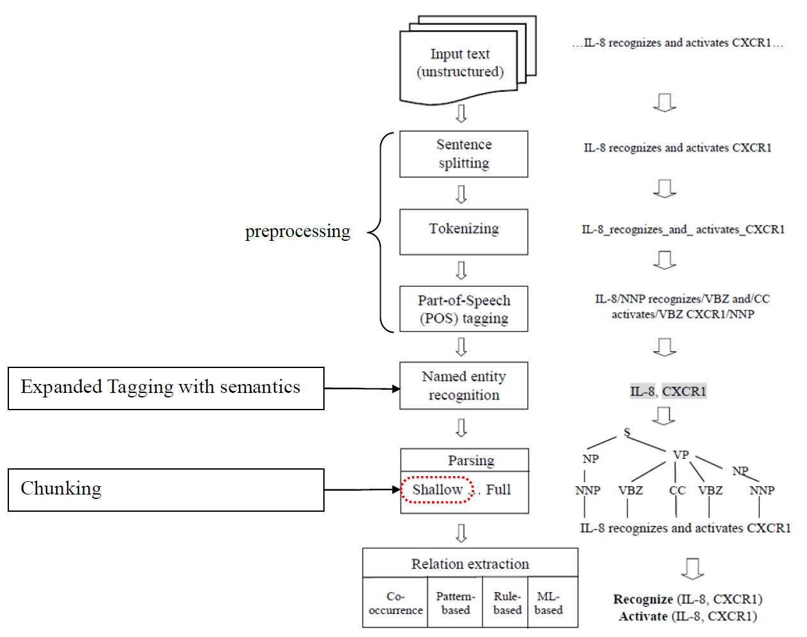
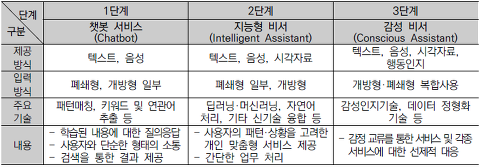

## 자연어처리(NLP)를 시작하기 전에

> 자연어처리 : NLP, Natural Language Processing

---

### AI는 Deep Learning이 아니다.

> **인공지능: AI, Artificial Intelligence**

인공지능와 관련된 분야에는 데이터 과학, 머신러닝, 딥러닝 등등 여러가지 분야가 있다. 우리는 그 중에서 인공지능 분야 중에서 자연어처리 분야를 공부해 볼 것이다. 즉, 기계가 사람의 말을 알아듣게 하는 자연어처리를 인공지능을 활용해 볼 것이다. 좀더 나아가 파이썬은 느리기 때문에 모델을 생성할때만 사용하며, 자연어처리 분야에서는 C나 Java를 이용한다. 또한 우리는 데이터를 **직접 수집**해볼 것이다. 왜냐하면 대부분의 데이터는 **한글이 아닌 영어 데이터이기 때문**이다. 

---

### Machine Learning의 일부인 Deep Learning
> AI 안에 Machine Learning 이 있고, 그 안 여러분야 중 Deep Learning이 있다.

이러한 것들이 가능하게 된 이유는 데이터의 양이 폭발적으로 늘어난 것과 우리가 그러한 데이터를 이용할 수 있게 됐기 때문이다. 빅데이터 분야에서는 관리해야할 주체이지만, 이번 수업에서는 이용해야할 주체이다. 예를 들면, 트위터의 트윗의 경우, 매 초마다 수십개씩 트윗되는데 우리는 그러한 데이터를 사용할 것이다.

---

### 결국 중요한 건 데이터의 크기

> 이메일 스팸필터링, 주식 예측, Amazon, Netflix 고객 예측 등

관련된 Application을 만들다보면, 머신러닝을 이용해도 중간에 결국 사람이 해석하기 위해서는 항상 부산물로 나오는 텍스트가 나올 것인데 그러한 처리할때 자연어처리를 핵심이다. 그 예시로 Google의 Gmail의 경우, 스팸 필터하는데, 아무리 스팸의 수가 많아져도, 스팸을 처리하는 성능을 여전히 뛰어나다. 이러한 것들을 NLP를 이용하여 스팸 처리해볼 것이다.

또 다른 예시로는, 항상 흥미로워하는 주가 예측에 대해서 생각해보자. 어떤 논문은 **감정분석을 통해서 가능**하기도 하다. 물론 항상 맞다고 할 수 없다. 왜냐하면 주가 같은 경우는 너무나 많은 특징들이 녹아들어있기 때문에 다양한 지수를 통해서 확인해보도록 하자.

다른 대표적인 성공적인 사례로는 **Amazon**을 살펴보자. 예전에는 사람을 기반으로 추천 알고리즘을 통해서 마켓팅을 했었다. 이제는 아이템 기반의 추천 알고리즘을 통해 재구매율을 30%나 상승함을 알 수 있었다. 즉, 사용자의 구매이력을 통해서 구매이력이 비슷한 아이템을 구매한 사람을 찾는게 아니라, 어떤 물건들이 같이 구매됐는지를 파악하여 어떤 아이템을 샀을때, 다른 아이템을 추천해주는 방식으로 Amazon은 성장하였다.

또 다른 예시는 **Netflix**이다. 이들의 가장 큰 특징은 내가 봤던 미디어를 통해서 앞으로 내가 볼 것들을 미디어를 추천해준다. 넷플릭스의 경우, 이들이 초고속 성장을 할 수 있었던 이유는, House of Card라는 자체 제작된 드라마였다. 앞서 파악된 사람들의 성향을 통해서 사람들이 무얼 좋아하는지 파악하여 투자를 하여 비슷한 해당 시리즈를 시청하게끔 했다.

---

### 머신러닝의 종류들

1. **Supervised Learning** : Task driven ( Regression / Classification )
    - Label이 된 데이터로 학습을 하는 것
    - SVM, Decision Tree

2. **Unsupervised Learning** : Data driven ( Clustering )
    - Label이 없는 데이터로 학습을 하는 것
    - 데이터만 있을때, 알아서 분류해봐라
    - Topic Modelling
        - LSA, LSI, LDA

3. **Reinforcement Learning** : Algorithm learns to react to an enviroment, 이번 교육에서는 진행되지 않으니 참고하자.

이 중에서 NLP에서 더 들어간다면, 아래와 같이 여러가지 분야가 있다

- NLP의 적용분야
    - translation
    - classfication / clustering
    - information extraction
    - speech to text / text to speech

> Statistics & Probabilities

- Statistics : likilihood
- Probabilities : Bayes theorom

---

### 그래서 우리는 NLP에서 무얼 배울까?

자연어처리(NLP)에서는 다루는 데이터의 크기가 매우 방대하기 때문에 통계적인(Statistical) 방법과 기계학습(Machine Learning) 방법빈도를 기반으로 추론하는 방법과 Knowledge, Language, Corpus 등 여러가지 토픽들이 있다. 사실 더 들어가면 Natural Language 생성과 이해가 있다. 

NLP의 하위 분야들
- Machine Translation
- Information Retrival
- Sentiment Analysis
- Information Extraction
- **Question Answering** -> 이게 사실상 NLP의 목표

---

### 자연어를 조금더 살펴보자
자연어 : 정보전달의 수단이며 인간 고유의 능력이며 인공어에 대응되는 개념
인공어 : 특정 목적을 위해 인위적으로 만든 언어, 자연어에 비해 엄격한 구문을 가짐

자연어처리란 컴퓨터를 통해서 자연어를 어떻게 다루는지 알아보는 학문이다. 또한 인간의 언어를 이해하고 이를 바탕으로 각종 정보처리에 적용함으로써 보다 빠르고 편리한 정보 획득한다.

#### 어절/단어/형태소
- 어절 : 양쪽에 공백을 갖는 띄어쓰기 단위의 문자열
- 단어/형태소 : 단일 품사를 갖는 단위 / 사전에 등록되어 있는 색인어의 집합

#### 형태론적 다양성
- 첨가어
    - 한국어, 일본어, 터키어 등
    - 다수의 형태소가 결합하여 어절 형성
    - 터키어는 평균 7개의 형태소가 결합
    - 희안하게 일본어는 한국어와 비슷하기 때문에 한글 분석을 잘한다.
- 굴절어
    - 라틴어, 영어와 불어 등은 첨가어와 굴절어의 특징이 모두 있음
    - 어간이 변함, 예를 들면 run,ran,run
    - 한국어와 다르게 영어는 단어 하나가 형태소 하나이기 때문에 처리과정이 단순, 즉 언어적인 특성상 분석이 훨씬 쉬움
- 스와히리어
    - 수(number)를 위한 형태소가 문두에 붙음
- 아랍어
    - 자음이 어간이고, 모음이 시제, 수 등을 표현
    - ktb(쓰다), kAtAb(능동), KUtlb(수동)
    - kttb(쓰게하다), kAttAb(능동), KUttlb(수동)

#### 통사적 다양성
- Postfix 언어
    - 동사가 문장의 뒤에 위치
    - 한국어, 일본어 등... 추후에 Bag of Word에 대해서 알아봄
    - 특히나 구어체는 분석하기에 훨씬 어려움
- Infix 언어
    - 동사가 문장의 중간에 위치
    - 영어, 불어 등
- Prefix 언어
    - 동사가 문장의 처음에 위치
    - 아일랜드어

---

### 일반적인 자연어 분석 4단계
#### 1. 자연어문장 입력  

#### 2. **형태소 분석(Morphological Analysis)**  
- 한국어는 형태소를 모두 쪼개서 최소한의 의미를 갖는 단위로 모두 쪼개자, 그렇게 해서 누가 명사고 누가 동사인지
- 입력된 문자열을 분석해서 형태소(morpheme)라는 최소 의미 단위로 분리
- 사전 정보와 형태소 결합 정보 이용
- 정규 문법으로 분석 가능
- 언어에 따라 난이도가 다름
- 과연 형태소분석이 잘 될까?  
    - 나는 책을 읽었다. -> 나 + 는
    - 하늘을 나는 새를 보라. -> 나다 + 는
    - 파릇파릇한 싹이 나는 계절이다. -> 나다 + 는
- 형태소 분석의 어려운 점을 나열하자면 중의성과 접두사/접미사 처리, 등록되지 않는 단어처리, 한국어 형태소 결합의 예('친구에게서였었다라고')

#### 3. **구문 분석(Syntax Analysis)**  
- 누가 주어이고, 누가 서술어인지 파악하자
- 문법(Grammar) : 문장의 구조적 성질을 규칙으로 표현한 것, a set of rewrite rules
- 구문 분석기(Parser) : 문법을 이용하여 문장의 구조를 찾아내는 과정, 문장의 구문 구조는 트리형태로 표현가능, 즉, 몇 개의 형태소들이 모여서 구문요소를 이루고, 그 구문요소들간의 결합구조를 트리형태로써 구문 구조를 이루게 됨
- CFG : Context Free Grammar
- Grammar Rule을 이용해서 문장을 생성(sentence generation)할 수 있고, 분석(sentence parsing)할 수도 있음
    - Top-down : S NP VP > N VP > John VP > John V NP > John ate ART N > ...
    - Bottom-up : John ate the apple > N V ART N > NL V ART N > NP V NP > NP VP > S
- 구문 분석도 모호함 문제가 발생
    - I saw the man on the hill with the telescope
    - 이러한 간단한 문장이 5가지로 분석
- 여기가 언어학적인 레벨에서 할 수 있는 한계

#### 4. **의미 분석(Semantic Analysis)**  
- 통사 분석 결과에 해석을 가하여 문장이가진 의미를 분석
- 형태소가 가진 의미를 표현하는 지식 표현 기법이 요구됨
- 통사적으로 옳으나 의미적으로 틀린 문장이 있을 수 있음, 문법적으로만 옳으면 안됨
    - 돌이 걸어간다. cf) 사람이 걸어간다
    - 바람이 달린다. cf) 말이 달린다
    - 사람이 사과를 먹는다 (O)
    - 사람이 ~~비행기~~를 먹는다 (X)
    - ~~비행기~~가 사과를 먹는다 (X)
- 의미 조차도 모호함
    - 말이 많다. 이때 말이 horse인지 speech인지
    - 사실 여기가 잘 안되기 때문에 화용분석이 잘 안되는 것임
- 여기서는 위의 문제들을 해결하기 위해서  WordEmbeding, Word2Vec, Topic 분석 등등

#### 5. **화용 분석(Pragmatic Analysis)**  
- 사실상 이게 가능하면, 컴퓨터랑 대화할 수 있음
- 문장이 실세계와 가지는 연관관계 분석
- 지시, 간접화법 등의 분석
    - Anaphora : 대명사의 지시 대상
    - Speech Act : 상대방에게 행동을 요구하는 언어 행위

#### 6. 분석 결과  

#### 전체적인 전처리 과정

---

### 챗봇(Chatbot)
영화 그녀(Her)
심심이와 왓슨(Watson) : 기계가 문맥과 의도를 파악할 수 있는가에 대한 이야기

**Siri / Google Assistant / Bixby**

---

### NLP Application Gap
- 연구 수준 : 이상적인 환경을 가정
    - 정확한 입력
    - 학습 데이터 존재
    - 정답이 존재
    - 대상 데이터가 고정
- 상용화 수준 : 다양한 비정상 상황 가정
    - 부정확한 입력
    - 학습데이터 구축의 어려움
    - 정답을 알 수 없는 문제도 있음
    - 실시간으로 대상 데이터 변함, Hadoop,Spark 등

